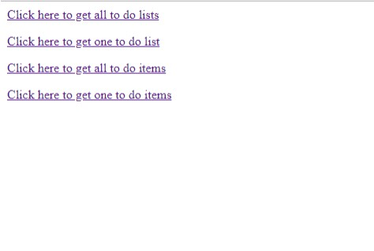
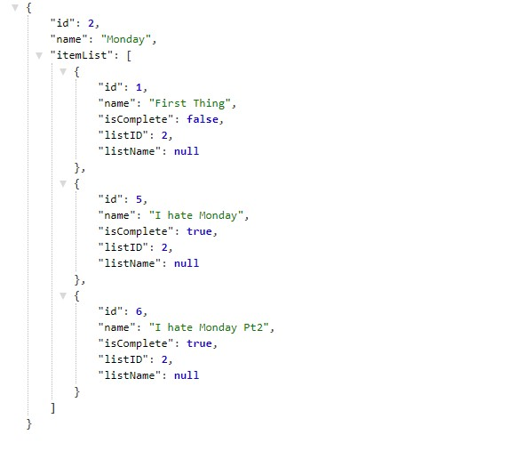

# Lab18_UsingAPI

## About this project
This project is a MVC application that consumes the API from Lab 17. The way it works is each hyperlink on the index page is routed to a method in the API controller. The requests are sent to the API, and data is returned as a JSON object. The object is then displayed as a page.

## Example

## How to use
This program requires Visual Studio to view or edit the source files or database. The program does not require visual studio if the user simply wants to navigate to the site. The URL to the deployed site is:

http://usingapi20180701105251.azurewebsites.net/

Once on the site, the user can click on the hyperlinks to perform their desired operation.

## Licensing
This program is used with a MIT license.

